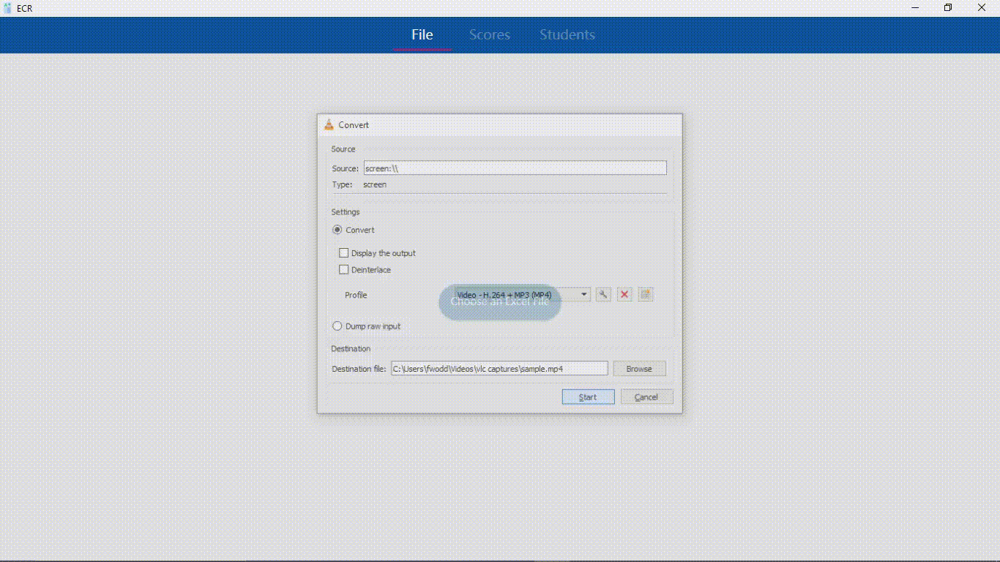

## SHS ECR Interface

A Windows application that simplifies editing Senior High School (SHS) Electronic Classroom Record (ECR) Excel files, including tasks such as adding or editing students, updating student scores, and presenting scores.

### Developed With

![C#.badge]  
![WPF.badge]  
![NET.badge]  

### Library Used

### Demo

[WPF.badge]: https://img.shields.io/badge/WPF-5C2D91?style=for-the-badge&logo=dotnet&logoColor=white
[NET.badge]: https://img.shields.io/badge/.NET-512BD4?style=for-the-badge&logo=dotnet&logoColor=white
[C#.badge]: https://img.shields.io/badge/C%23-239120?style=for-the-badge&logo=csharp&logoColor=white
